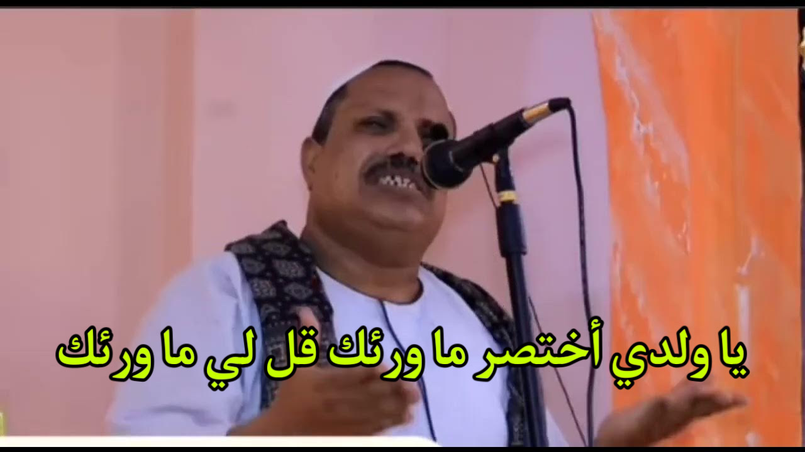

 
💀 𝐋𝐄𝐓'𝐒 𝐃𝐎 𝐓𝐇𝐈𝐒 💀

---

### ماهي البرمجة ؟

خليني ياعزيزي أبسطهالك
البرمجة هي ألاكواد اللي بيكتبها المبرمج علشان يتكلم مع الكمبيوتر
- مثال
 
  -  لو عاوز تكلم واحد فرنسي مثلا هل هتكلمه عربي ؟ 
أكيد لا مش هيفهمك هتحاول تتواصل معاه بلغتة سواء كان من خلال تعلمك للغة أو بواسطة شخص أخر

كذالك انت لما تبقا عاوز تكلم الكمبيوتر هتستخدم نفس الاسلوب ده هتتعلم لغتة
طب لغة الكمبيوتر أيه قالك 
Binary Code 

ياعزيزي أتقل أنا عاوزك تفهم علشان تقدر تصيغ التعريف حسب فهمك 
ال Binary Code ده أو لغة الآله هيا عباره عن 0 , 1 
